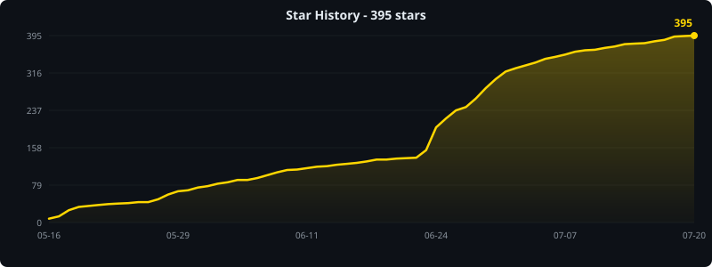

<p align="center">
  
</p>

<h1 align="center">Dinotty</h1>

<p align="center">
  <a href="https://github.com/xichan96/dinotty/blob/main/LICENSE"></a>
  
  
  <a href="https://github.com/xichan96/dinotty/stargazers"></a>
  <a href="https://github.com/xichan96/dinotty/releases"></a>
  <a href="https://github.com/xichan96/dinotty/issues"></a>
</p>

<p align="center">
  <a href="../README.md">中文</a> | <a href="./README.en.md">English</a> | <a href="./README.ru.md">Русский</a> | <a href="./README.pt.md">Português</a> | 한국어 | <a href="./README.es.md">Español</a> | <a href="./README.de.md">Deutsch</a> | <a href="./README.fr.md">Français</a>
</p>

---

코딩 에이전트를 위한 터미널.

어떤 디바이스에서든 Claude Code, opencode, Codex, OpenClaw를 실행하세요 -- 심플하고 확장 가능하며 멀티 디바이스, 세션을 잃지 않습니다.

## 스크린샷

<p align="center">
  
  
  
</p>
<p align="center">
  
  
  
</p>
<p align="center">
  
</p>

## 데스크톱 데모

데스크톱 클라이언트는 iTerm2에 비견되는 전문적인 경험을 제공합니다:

**분할 브로드캐스트** - 드래그 가능한 멀티 패인 분할, 한 패인에 입력하면 모든 패인에서 동시에 실행:

<p align="center">
  
</p>

**명령 북마크** - 터미널 텍스트 우클릭으로 북마크, 그룹 관리, 원클릭 실행:

<p align="center">
  
</p>

**SSH 연결 및 파일 브라우저** - 내장 SSH 클라이언트, 원격 세션이 로컬처럼, 완전한 SFTP 파일 관리:

<p align="center">
  
</p>

**워크스페이스 관리 및 Mission Control** - 멀티 워크스페이스 격리, Mission Control 개요, 빠른 전환:

<p align="center">
  
</p>

**플러그인 시스템** - 핫 리로드 가능한 JS 플러그인, 내장 CC Switch, JSON Formatter 등:

<p align="center">
  
</p>

**통합 레이아웃 시스템** - 터미널, 플러그인, 파일 브라우저, 웹 미리보기가 모두 패인; 드래그 가능한 분할, 탭 간 이동, 새 탭으로 추출:

<p align="center">
  
</p>

## 왜 Dinotty인가?

터미널 기반 코딩 에이전트(Claude Code, opencode, Codex, OpenClaw 등)는 강력하지만, 하나의 터미널 창 안에 갇혀 있습니다. Dinotty는 다음을 가능하게 합니다:

- **어떤 디바이스에서든 에이전트 관리** - 데스크톱에서 깊이 있는 작업, 자리를 비울 때 폰으로 QR 코드를 스캔해 에이전트 작업을 중단 없이 모니터링하고 관리
- **멀티 디바이스 동기화, 끊김 없는 전환** - 노트북에서 시작, 폰에서 계속; 노트북으로 돌아와서 정확히 그 자리에서 재개
- **에이전트 출력 직접 검증** - 코드 diff, 렌더링된 페이지, 생성된 파일, 모두 내장 브라우저에서 보기
- **세션을 절대 잃지 마세요** - 연결 끊김, 화면 잠금, 디바이스 전환 - 돌아오면 모든 것이 정확히 그 자리에

### 경량 - 원격 데스크톱이 아닙니다

| | Dinotty | 원격 데스크톱 (VNC/RDP/Parsec) |
|---|---|---|
| **전송 데이터** | 텍스트만 (JSON, 바이트) | 30-60 fps로 전체 화면 픽셀 |
| **대역폭** | 일반적으로 ~1–10 KB/s | ~1–10 MB/s (100–1000배 더) |
| **모바일 데이터 친화적** | ✅ 3G/4G에서 랙 없이 동작 | ❌ 끊김, 고지연, 데이터 소모 |
| **약한 신호 허용** | ✅ 자동 재연결, 프레임 손실 없음 | ❌ 화면 멈춤, 입력 지연 |
| **배터리 소모** | 낮음 (텍스트 렌더링) | 높음 (비디오 디코딩) |
| **해상도 적응** | 모든 크기에서 네이티브 텍스트 | 스케일된 비트맵, 폰에서 흐림 |
| **인터랙션** | 네이티브 터치, 커스텀 키보드 | 시뮬레이션된 마우스, 작은 데스크톱 UI |

## 주요 기능

- **서버 측 가상 터미널** - 완전한 VTE 파서, 서버가 정확한 화면 상태를 알고 있음, 세션 복구 및 화면 스냅샷 지원
- **세션 지속성** - PTY 프로세스가 연결 끊김을 견딤, 지수 백오프로 자동 재연결, 페이지 새로고침으로 복구
- **패인 분할 및 멀티 탭** - 드래그 가능한 분할, 서버 주도 패인 라이프사이클로 멀티 탭 관리
- **워크스페이스 관리** - 멀티 워크스페이스 격리, Mission Control 개요, 워크스페이스 스코프 플러그인 탭
- **브로드캐스트 모드** - 한 패인에 입력, 모든 패인에서 동시 실행, 무료
- **명령 북마크** - 터미널 텍스트 우클릭으로 북마크, 그룹 관리, 원클릭 실행
- **원격 SSH 연결** - 비밀번호/키 인증 내장 SSH 클라이언트, 원격 세션이 로컬처럼
- **원격 파일 관리 (SFTP)** - SSH 연결에서 자동 활성화, 완전한 파일 브라우즈/편집/업로드/다운로드
- **서버 목록** - 여러 원격 서버 관리, 빠른 연결 전환
- **반응형 레이아웃** - 세로 모드는 수직 스택, 가로 모드는 나란히; 터치 최적화된 버튼 및 패인 리사이즈
- **커스터마이즈 가능한 단축키 키보드** - 모바일용 Ctrl/Esc/기능 키 추가, 임의의 escape 시퀀스 지원
- **내장 파일 브라우저** - 코드 하이라이팅, Markdown 렌더링, Office 문서 미리보기, 오디오/비디오 재생
- **Git 변경 표시기** - 추가/수정/삭제 라인에 대한 gutter 마크, inline diff, Stage/Revert
- **웹 미리보기** - iframe에서 로컬 dev 서버를 미리보기 위한 내장 리버스 프록시
- **알림 시스템** - terminal bell/OSC 감지, WebSocket 푸시, 설정 가능한 사운드 알림
- **시스템 모니터** - 실시간 CPU/메모리/네트워크 차트
- **플러그인 시스템** - JS 플러그인 + CLI 브릿지, 핫 리로드; CC Switch, JSON Formatter, Claude Code 대화 관리자 등 탑재
- **Open API** - 외부 디바이스 제어용 HTTP 엔드포인트 (Stream Deck, Shortcuts, 자동화 스크립트)
- **명령 팔레트** - 빠른 액세스 명령 런처
- **데스크톱 앱** - 선택적 Tauri 기반 네이티브 클라이언트

## 핵심 차별점

- **서버 측 가상 터미널** - WebSocket-to-PTY 파이프가 아님; PTY가 연결 끊김을 견딤, 페이지 새로고침으로 세션 복구
- **멀티 디바이스 동기화** - 브라우저 기반 동기화, 데스크톱에서 깊이 있는 작업, 모바일에서 인계
- **경량 텍스트 전용 전송** - ~1-10 KB/s, 3G/4G에서 부드럽게, 원격 데스크톱 대비 100-1000배 적은 대역폭
- **자체 포함된 환경** - 내장 파일 브라우저, 웹 미리보기, Git 변경, SSH/SFTP, 플러그인 시스템
- **무료 및 오픈 소스** - 셀프 호스팅, 구독 없음, 릴레이 수수료 없음

자세한 내용은 [다른 솔루션과의 비교](getting-started/comparison.en.md)를 참조하세요.

## 설치

[GitHub Releases](https://github.com/xichan96/dinotty/releases)에서 플랫폼에 맞는 설치 프로그램 또는 바이너리를 다운로드하세요:

| 플랫폼 | 형식 | 비고 |
|----------|--------|-------|
| **macOS** | `.dmg` | 열고 Applications로 드래그 |
| **Linux** | `.deb` | `sudo dpkg -i dinotty_*.deb` |
| **Windows** | `.exe` / 소스 빌드 | PowerShell에서 `dinotty-server.exe` 실행, 또는 소스에서 빌드 |

> 소스에서 빌드할 수도 있습니다, 아래 "빠른 시작"을 참조하세요.

**macOS 참고사항**: 앱이 서명되지 않았기 때문에 macOS가 **"Dinotty"이(가) 손상되었으며 열 수 없습니다**라고 표시할 수 있습니다. 설치 후 다음 명령을 실행하여 제한을 해제하세요:

```bash
xattr -cr /Applications/Dinotty.app
```

**Linux 한 줄 설치**:

```bash
VERSION=$(curl -s https://api.github.com/repos/xichan96/dinotty/releases/latest | sed -n 's/.*"tag_name": *"\([^"]*\)".*/\1/p' | sed 's/^v//') && curl -LO "https://github.com/xichan96/dinotty/releases/download/v${VERSION}/dinotty-server_${VERSION}-1_amd64.deb" && sudo dpkg -i "dinotty-server_${VERSION}-1_amd64.deb"
```

**Linux 시작**:

```bash
# systemd
systemctl start dinotty
systemctl enable dinotty  # 부팅 시 자동 시작

# Docker 컨테이너
nohup dinotty-server &
```

**Windows 시작**:

```powershell
# PowerShell
.\dinotty-server.exe -p 8999

# 선택 사항: 자동 감지 전 기본 shell 재정의
$env:DINOTTY_SHELL = "pwsh.exe"
.\dinotty-server.exe
```

Windows에서 기본 shell은 이 순서로 감지됩니다: `DINOTTY_SHELL` -> `pwsh.exe` -> `powershell.exe` -> `%ComSpec%` / `cmd.exe`.

기본 포트는 **8999**입니다. 시작 후 `http://<your-ip>:8999`에 접속하세요. 커스텀 포트를 지정하려면 `-p`를 사용하세요:

```bash
dinotty-server -p 3000
```

## 빠른 시작

```bash
# 저장소 클론 (shallow clone 권장 - 더 빠르고 작음)
git clone --depth 1 --single-branch -b dev git@github.com:xichan96/dinotty.git
cd dinotty

# 프론트엔드 빌드
cd frontend && pnpm install && pnpm run build && cd ..

# 서버 실행
cargo run
```

Windows PowerShell 동등 명령:

```powershell
git clone --depth 1 --single-branch -b dev git@github.com:xichan96/dinotty.git
cd dinotty
cd frontend
pnpm install
pnpm run build
cd ..
cargo run
```

브라우저에서 http://127.0.0.1:8999 를 여세요.

```bash
# 디버그 로깅과 함께 백엔드 실행
RUST_LOG=debug cargo run

# 프론트엔드 타입 체크
cd frontend && npx vue-tsc --noEmit
```

```powershell
# Windows PowerShell 디버그 로깅
$env:RUST_LOG = "debug"
cargo run
```

## 기술 스택

| 레이어 | 기술 |
|-------|-----------|
| 백엔드 | Rust, Axum 0.7, Tokio, portable-pty, vte, russh, russh-sftp |
| 프론트엔드 | Vue 3, TypeScript, Vite, xterm.js 5 |
| 데스크톱 | Tauri |

**Rust로 작성됨 · 단일 바이너리 · 제로 의존성** - 서버에서 완전한 VT 상태 머신을 실행, 파이프를 전달하는 프록시가 아니므로 세션이 연결 끊김을 견딥니다.

## 추가 문서

- [비교](getting-started/comparison.en.md) - ttyd/gotty/Wetty 및 다른 AI 코딩 원격 솔루션과의 차이점
- [배포 가이드](getting-started/deployment.en.md) - systemd, Docker, Windows 네이티브 실행, 크로스 플랫폼 빌드, 설정
- [릴리스 가이드](getting-started/releasing.en.md) - 통합 버전 관리, 버전 PR, `dev`에서 `main`으로 프로모션, 태그 및 GitHub Releases
- [파일 에디터](features/file-editor.en.md) - 패인 분할, 멀티 커서 편집, Cursor Group 크로스 파일 동기화
- [알림 시스템](features/notifications.en.md) - HTTP API, Claude Code 통합, Open API
- [플러그인 시스템](plugins/plugins.en.md) - 설치, 매니페스트, API, 내장 플러그인
- [플러그인 개발](plugins/plugin-development.md) - 전체 플러그인 개발 가이드
- [호스트 클립보드 API](api/clipboard-api.md) - 모바일 호스트 붙여넣기에서 사용하는 민감한 인증 엔드포인트
- [MCP 서버](api/mcp-server.md) - AI 어시스턴트가 터미널 세션을 조작하기 위한 내장 MCP JSON-RPC 서버
- [토큰 권한 시스템](internals/token-system.md) - capability 기반 멀티 토큰 세분화된 액세스 제어
- [이벤트 버스](internals/event-bus.md) - 모듈 간 이벤트 디스패치를 위한 글로벌 이벤트 버스
- [감사 로그 및 웹훅](internals/audit-webhook.md) - API 사용량 추적 및 외부 알림
- [기여](getting-started/contributing.en.md) - 브랜치 전략, 커밋 컨벤션, 코드 스타일

## 기여자

Dinotty에 기여한 모든 분들께 감사드립니다!

<a href="https://github.com/xichan96/dinotty/graphs/contributors">
  
</a>

## Star History



## 라이선스

MIT
